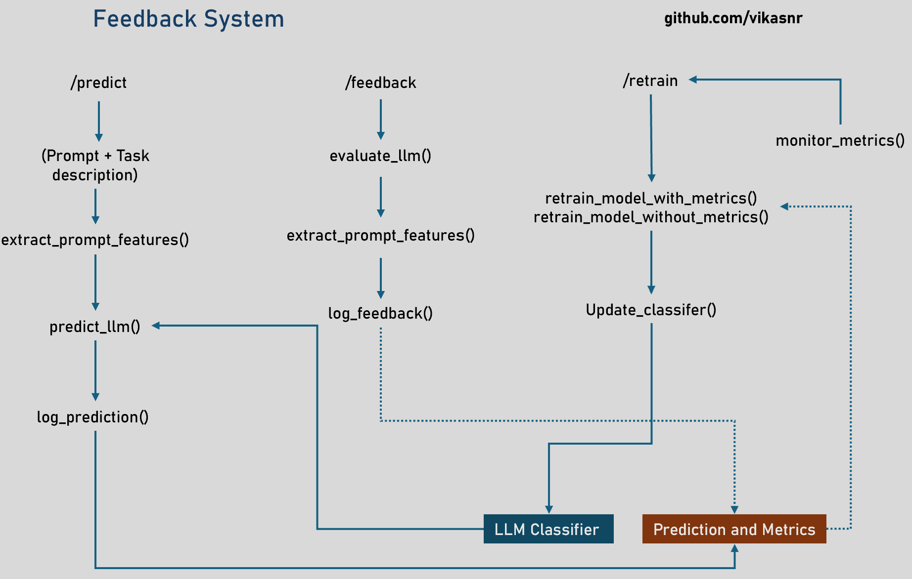

#### Why I chose to Synthesize Features Instead of Using Public Datasets  

I lacked programmatic access to LLM models, which restricted my ability to create features for this assignment. Preprocessing publicly available benchmark datasets like "grade-school-math," "hellaswag," "mmlu," "arc-challenge," "mbpp," "winogrande," and "mtbench" presents several challenges in terms of time and data integration. These datasets vary significantly in structure, format, and granularity, making it difficult to standardize them into a unified feature set.  

Aggregating data from Hugging Face and other benchmark sources requires extensive cleaning, normalization, and alignment of missing attributes. Many datasets lack key metadata which are essential for my classifier. Additionally, these benchmarks often focus on specific LLM capabilities rather than providing a balanced distribution across all prompt types. 

#### Refer notebooks/data_preprocessing.ipynb for more details on preprocessing.

#### For model training and inference refer notebooks/Modelling_Final.ipynb

##### Refer model architecture - notebooks/files/xgboost_arch.png

### Feedback system

#### API Endpoints

##### `/predict`
- Endpoint that takes a prompt, task description and returns the best LLM model based on the features of the prompt and the confidence score.
- Calls **`predict_llm()`**
  - Extracts features from the prompt, predicts the best LLM model, and logs the prediction.

##### `/feedback`
- Endpoint that takes a prompt, response, correct LLM model, and ground truth response, and logs the feedback scores.
- Calls **`evaluate_llm()`**  
  - Computes the faithfulness, BLEU, and ROUGE scores using the response and ground truth response.
- Calls **`log_feedback()`**  
  - Logs the feedback scores and the correct LLM model for future training.

##### `/retrain`
- Endpoint that retrains the LLM model based on the feedback logs.
- Calls **`retrain_model_with_metrics()`**  
  - Loads previous LLM selection data, faithfulness, BLEU, and ROUGE scores, and retrains the model.
- Calls **`retrain_model_without_metrics()`**  
  - Loads logs, converts them to a DataFrame, extracts features, retrains the model, and saves the updated models.
  
**Note:** Retraining can be triggered manually or automatically based on feedback logs.

##### `/llm_call`
- **(Dummy function)**
- Takes a prompt and the LLM model name and returns the generated response.

#### Refer feedback_system folder for more details

### Limitation and scope for improvement

- ###### Lack of Generalization to Real-world Tasks
    Synthetic data may not capture real-world distribution: Synthetic dataset doesn’t closely resemble real user queries and responses. This is one area which will need greater amount of time - fetching from varies source and aggregating them for modules.

- ###### Feature selection
    I wouldn't say the features choosen initially are the best. All though I have added BLEU, ROUGE scores etc for feedback retraining. It could be helpful to have it while intial modelling.

